um add i>
dsadsa

# Representing Instructions

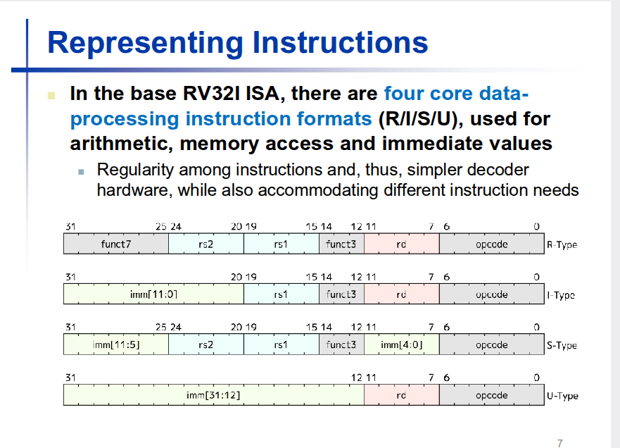
todos os formatos tem 32 birts.

se o campo nao e igual e a juncao de um ou mais campos usando as mesmas posicoes..

isto e complicado para o hardware seja simpokes... quase todas as arqueitecturas , consumir mesno energia...

quase tudo que e preciso saber esta aquuii...

quatro fomratos para representar....

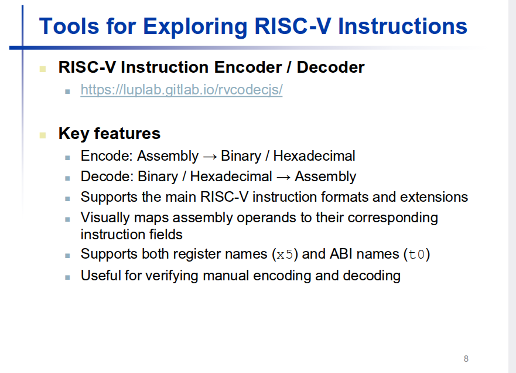

aprender sem experimentar e impossivel ahahaha ...
este feito em javascript.....

coficacao e descodificao , e da a instrucao !!!  forma facil de experimentar os exercicios das aulas...

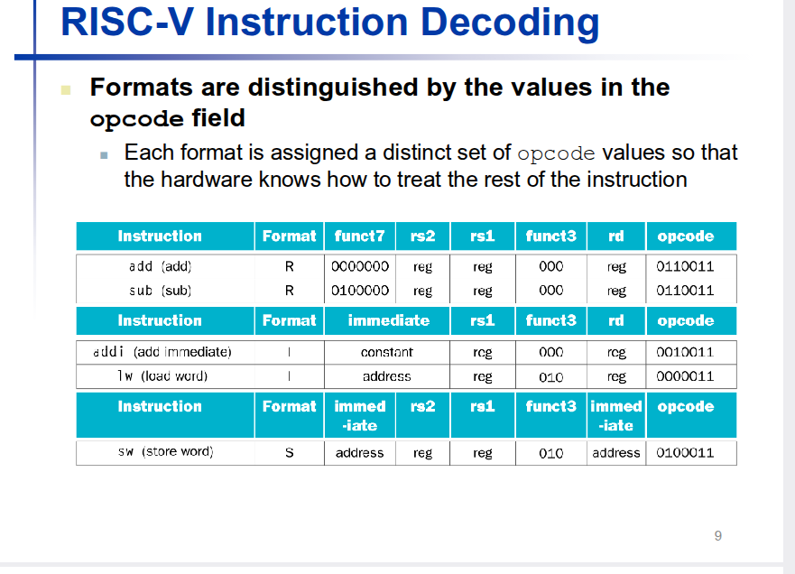

como e que eu sei que instrucao eue e e sabendo que instrucao que e , quais  destes 4 formatos vai mapear...

opcode...

o cpu primeiro olha para os primeiros 7...

primeiro olhar para o opcode que detemina o tipio de instuccao !!

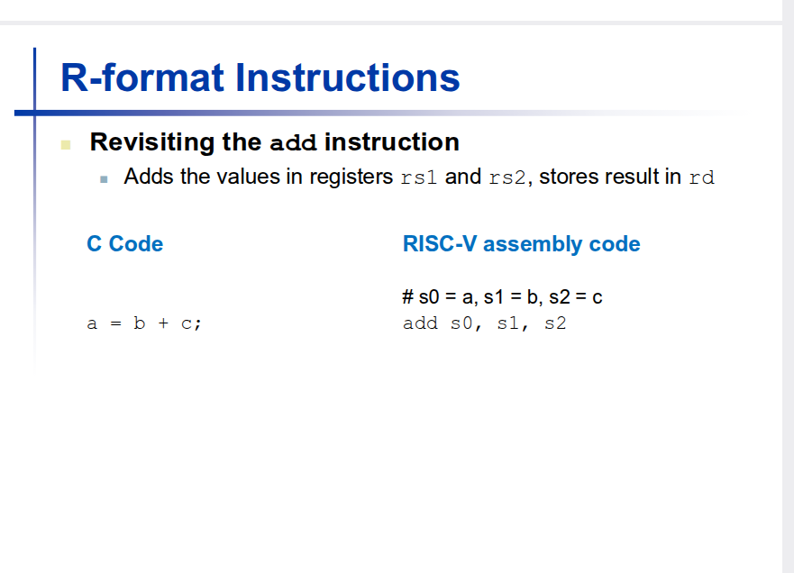

tosdos os 3 operandos sao registos...  p

saber o registo e perceber a instrucao ,
todas as instrucoes de formato r tem opcode 7bits.... instrucao de formato R , os restantes bits estao divididos naquelen... rs1 rs2 funct7 .....

Porque rd rs1 e rs2 tem 5 bits cada ?

qualquer que seja o numero do registo eu consigo em eescrever 5 bits....

numero do registo nao e o vaolor que esta guardado no resgisto !!!

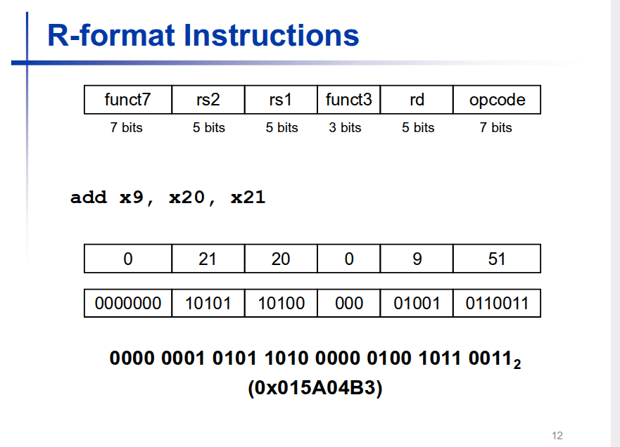
para colocar isto em binario,

aqui estou a fazer o contraio do cpi=uj...

tenho de consegui perceber isto ...s
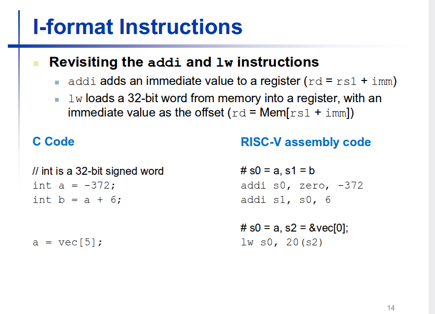vamos avancar para as instrucoes,,,

porque um  load e de um formato I ...

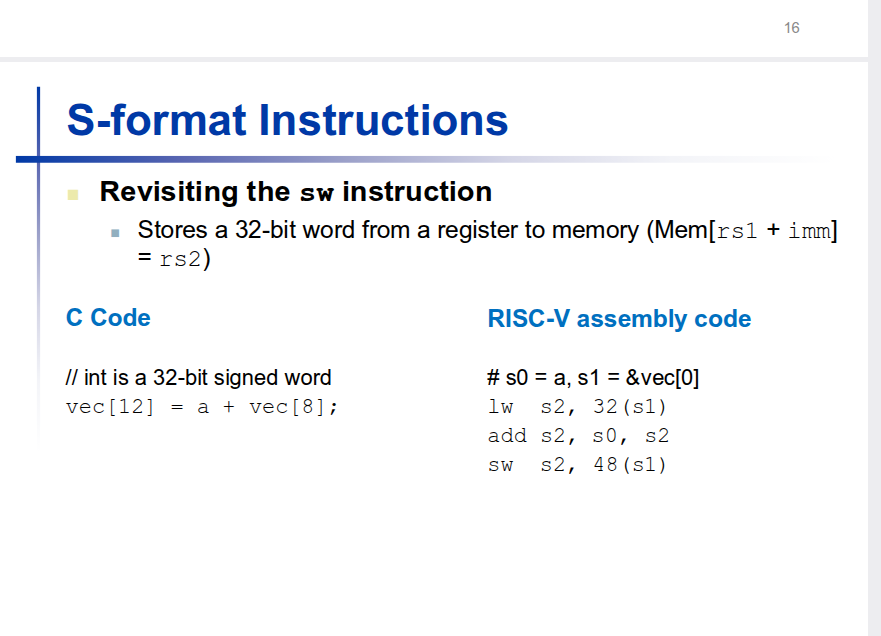

vec 8 a memoria , para esta aula o que importa, se olharem para o load ou para o store..
rd nao ha registo do destino !!!

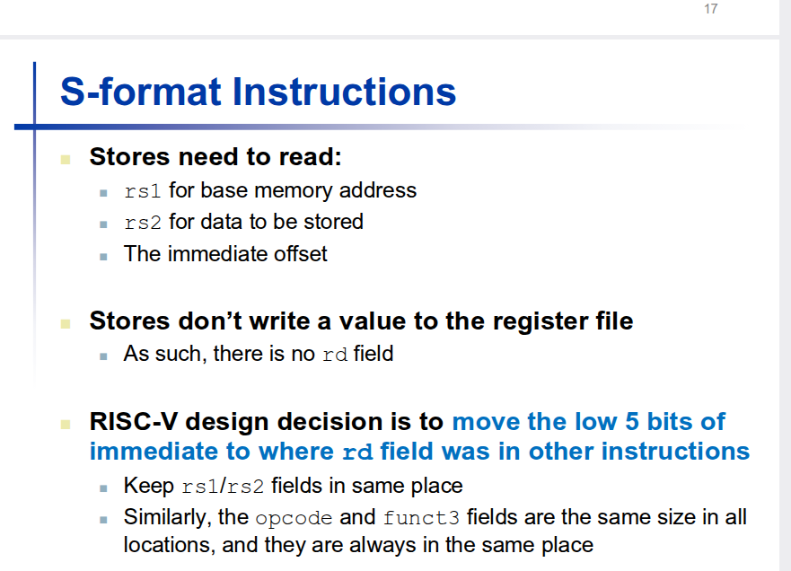

a solucakonesta arquitectura e manter o s campos que sao comum mno memsmo sistiio... mas mantemos no mesmo sitio ou juntamos dois ou mais ....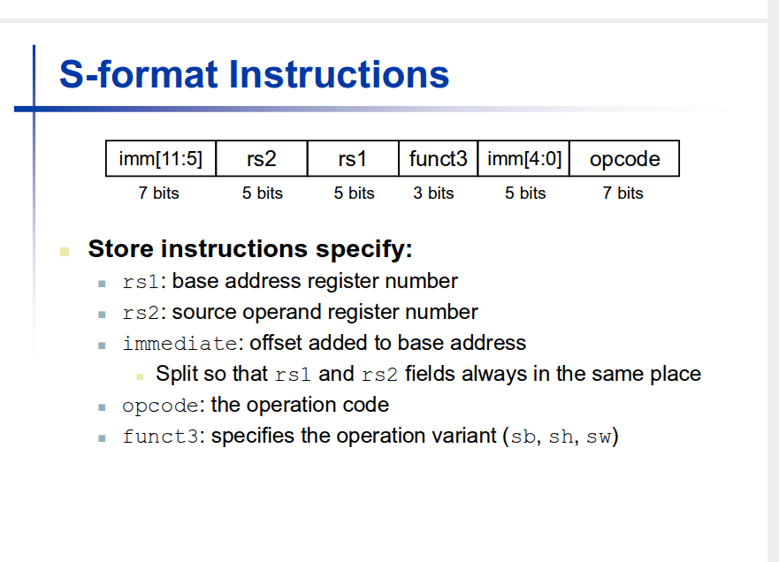

7 bit s nos bits mais significativosm no formato i ocupar 12 bits todos seguidos. nesta intrucao de foramto s , rs1 rs2 func3 no meso sitio... nao preciso rd ...

aula que tem mais detalhes...

aqueles dois campos sao ..

para eu manter

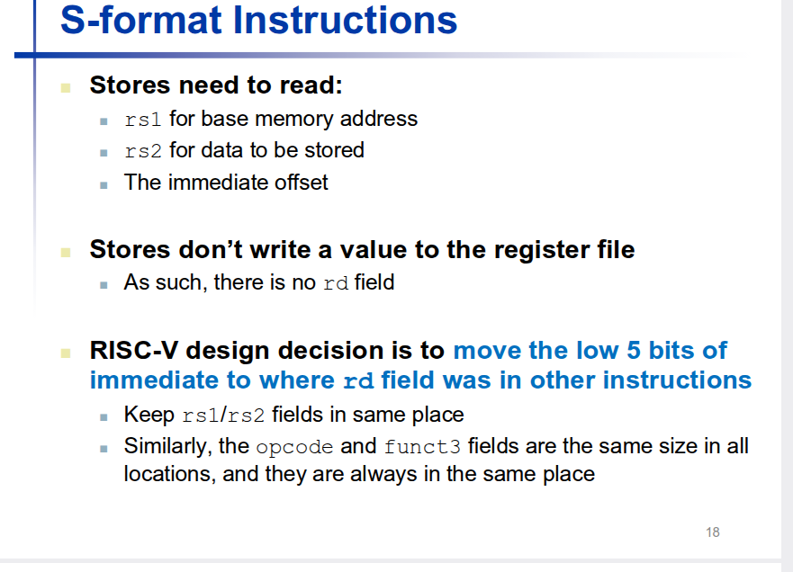

a descodificacao deve ser o mais rapido possivel !!

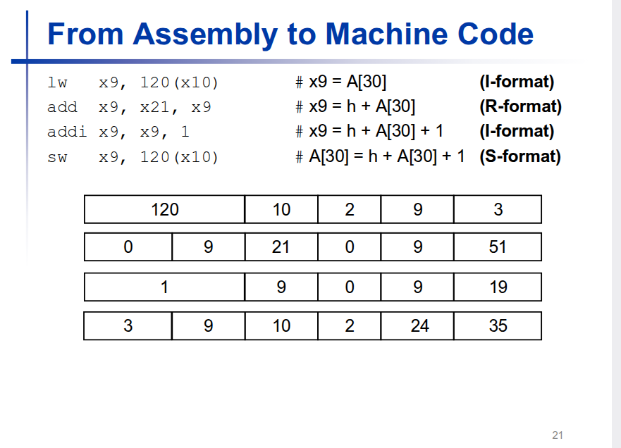

juntar os tre formatos R I S

o objectivo , e perceber porque os cmapos sao estes...  aqui esta o opcode... , quando e igual quando nao e igual sera 2 ou mais campos para representar...

se um program de alto nivel precisa de mais de 12 bits temos de ter algo que a suporta !!

qunadots bits necessito

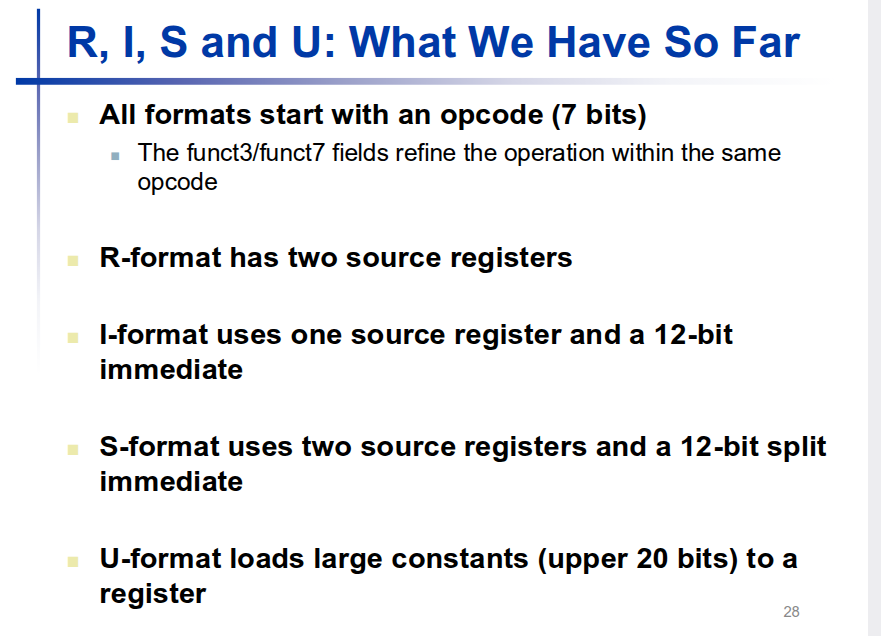

os quatros formatos , resumindo todas as operacoes, tem opcode, r tem dois registos fontes e destino, I , S vai separa 12 bits... e o U fornece a possibilidade de escrever constantes...

qual e aprincipal do risc, colocar a dificuladade no software nao no hardware...

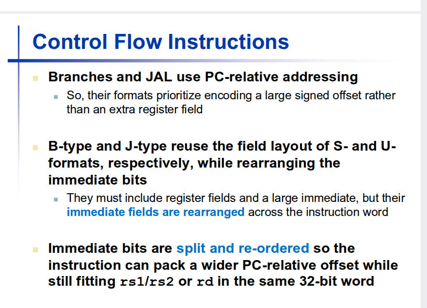
que instrucao falta ver, mas ja vinmos na sultimoas aulas...

b de branch e j ..

o seu proposito e optimizar os saltos de um programa, instrucoes de formato S 12 bits as de formato U 20 bits...
todas instrucoes tem 4 bytes de tamanha...

endereco programcounter  , par.

binario o valpor par termina sempre em -0.

if and else , eu escrevo uma label vai ser traduzido na distancia, <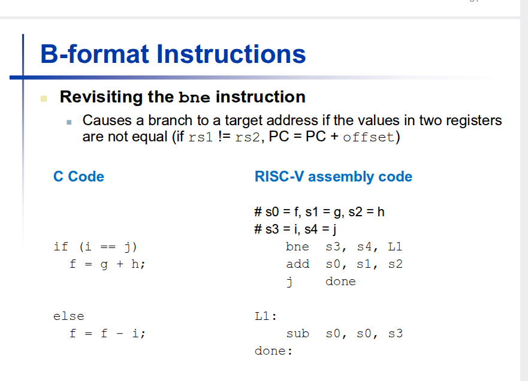

multipo de em binario termina sempre em 00...

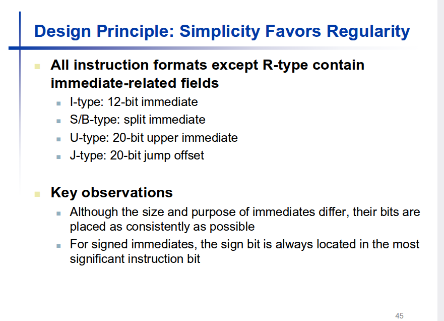

t=a regularidade deste sformatos vai , simplificar muito o hradware.

vou so mostratr o oposto..

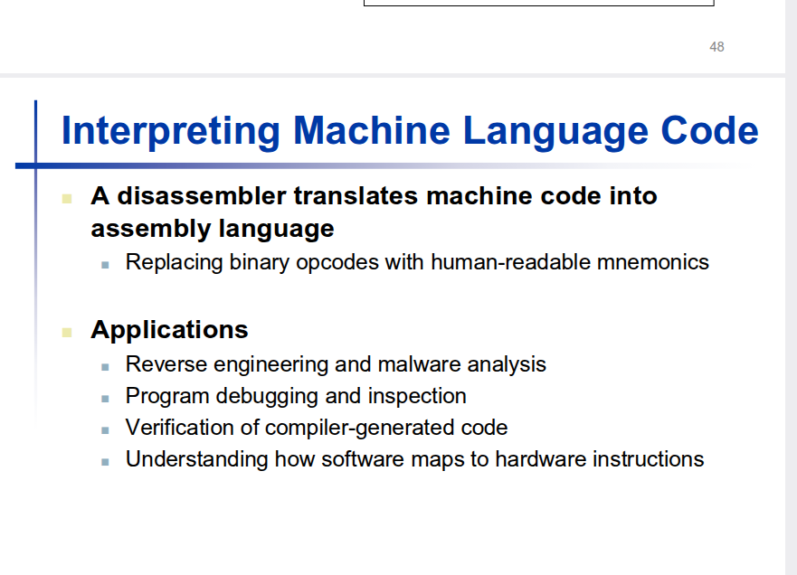

existem n cenarios, em que no s temos que olhar para codigo que foi compilado... !! crackar jogos e crackar licaencas e so a melhor forma de o fazer....

ou nest area. , da muito dinheiro mas muitas dores de cabeca.. o compilador tem de ser certificado !  o compiolador nao se limita  atraduzir c para assembly , introduz ene optimixacoes... , o caso medio e diferente de WCET ha tantas oprimizacoes....

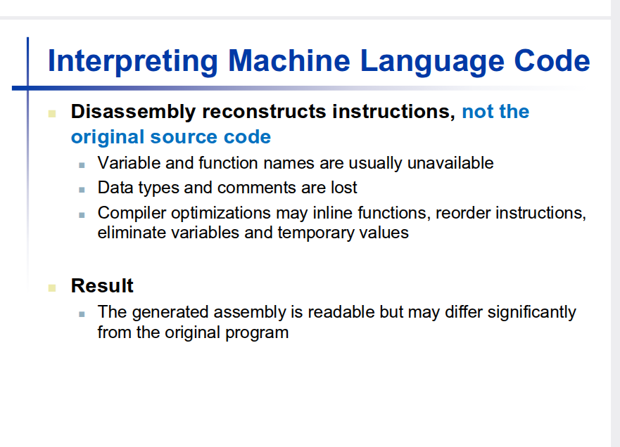

dissasembly, olhar para conjunto de 32 biuts... nao ha nehuma ferramenta que olhe para codigo executavel e vos de o codigo c original !!

 dissabembler em linux , saber quais sao !!

olhando para o opcode sei que

objdump e um dissasembler qualquer.... program C pequeno e pego no dissasembler, gcc ,  gcc -s para no assembler...
