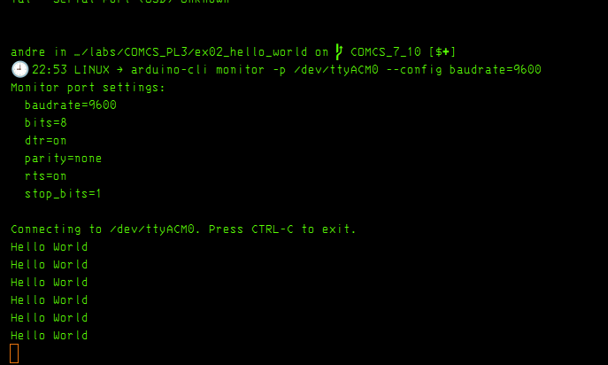

andre in ~ via C v13.3.0-gcc via 🐍 v3.12.3
🕘 21:18 LINUX ✗ ls -l /dev/ttyUSB* /dev/ttyACM* 2>/dev/null
crw-rw----+ 1 root dialout 166, 0 Oct  7 21:13  /dev/ttyACM0
crw-rw----+ 1 root dialout 166, 1 Oct  7 21:13  /dev/ttyACM1

andre in ~ via C v13.3.0-gcc via 🐍 v3.12.3
🕘 21:18 LINUX ✗ for d in /dev/ttyACM0 /dev/ttyACM1; do echo "=== $d ==="; udevadm info -q property -n "$d" | grep -E 'ID_VENDOR=|ID_MODEL=|ID_SERIAL='; done
=== /dev/ttyACM0 ===
ID_MODEL=USB_JTAG_serial_debug_unit
ID_SERIAL=Espressif_USB_JTAG_serial_debug_unit_7C:2C:67:8B:D7:E8
ID_VENDOR=Espressif
=== /dev/ttyACM1 ===
ID_MODEL=USB_Single_Serial
ID_SERIAL=1a86_USB_Single_Serial_5972065688
ID_VENDOR=1a86

primeiros comandos da PL3

>  ja podemos dizer que e certamente um dispositivo Espressif ......andre in ~ via C v13.3.0-gcc via 🐍 v3.12.3
> 🕘 21:25 LINUX ➜ arduino --version
> Picked up JAVA_TOOL_OPTIONS:
> Loading configuration...
> Initializing packages...
>
> Preparing boards...
> Arduino: 1.8.19


tenho de fazer upload e depois compile o codigo

> arduino-cli compile --fqbn esp32:esp32:esp32s3 .

>  arduino-cli upload -p /dev/ttyACM0 --fqbn esp32:esp32:esp32s3 .

agora
arduino-cli board details -b esp32:esp32:esp32s3 | grep -i -E 'USB|CDC'


Connecting to /dev/ttyACM0. Press CTRL-C to exit.
^C
andre in …/labs/COMCS_PL3/ex02_hello_world on  COMCS_7_10 [$✚] took 1m48s
🕘 22:46 LINUX ➜ arduino-cli board details -b esp32:esp32:esp32s3 | grep -i -E 'USB|CDC'
Option:        USB Mode                                                              USBMode
               Hardware CDC and JTAG                          ✔                      USBMode=hwcdc
               USB-OTG (TinyUSB)                                                     USBMode=default
Option:        USB CDC On Boot                                                       CDCOnBoot
               Disabled                                       ✔                      CDCOnBoot=default
               Enabled                                                               CDCOnBoot=cdc
Option:        USB Firmware MSC On Boot                                              MSCOnBoot
               Enabled (Requires USB-OTG Mode)                                       MSCOnBoot=msc
Option:        USB DFU On Boot                                                       DFUOnBoot
               Enabled (Requires USB-OTG Mode)                                       DFUOnBoot=dfu
               UART0 / Hardware CDC                           ✔                      UploadMode=default
               USB-OTG CDC (TinyUSB)                                                 UploadMode=cdc
               Integrated USB JTAG                                                   JTAGAdapter=builtin
               ESP USB Bridge                                                        JTAGAdapter=bridge

andre in …/labs/COMCS_PL3/ex02_hello_world on  COMCS_7_10 [$✚]
🕘 22:46 LINUX ➜


mandou me compilar com isto !!! 

> arduino-cli compile --fqbn esp32:esp32:esp32s3 --board-options "USBMode=hwcdc,CDCOnBoot=cdc,UploadMode=default" .
>





resolucao da 


### 📓 Comandos essenciais — ESP32-S3 / PL3

Para este ESP32-S3, guarda este fluxo:

```bash
arduino-cli compile --fqbn esp32:esp32:esp32s3 --board-options "USBMode=hwcdc,CDCOnBoot=cdc,UploadMode=default" .
```

```bash
arduino-cli upload -p /dev/ttyACM0 --fqbn esp32:esp32:esp32s3 --board-options "USBMode=hwcdc,CDCOnBoot=cdc,UploadMode=default" .
```

```bash
arduino-cli monitor -p /dev/ttyACM0 --config baudrate=9600
```

Para confirmar a porta quando houver dúvida:

```bash
arduino-cli board list
```

`Ctrl+C` fecha o monitor série.

**Regra importante:** nesta placa usa sempre `esp32:esp32:esp32s3`, não `esp32:esp32:esp32`. O `Lab03.ex02` considera concluído quando `Hello World` aparece no monitor série. PL3 - COMCS - Laboratory Class …


As aspas em:

```
--board-options"USBMode=hwcdc,CDCOnBoot=cdc,UploadMode=default"
```

servem para garantir que o shell trata tudo como **um único argumento** passado a **--board-options**.

Neste caso concreto, como não existem espaços nem caracteres problemáticos, também funcionaria sem aspas:

```
arduino-cli compile --fqbn esp32:esp32:esp32s3 --board-optionsUSBMode=hwcdc,CDCOnBoot=cdc,UploadMode=default .
```

arduino-cli compile --fqbn esp32:esp32:esp32s3 --board-options USBMode=hwcdc,CDCOnBoot=cdc,UploadMode=default .


arduino-cli upload -p /dev/ttyACM0 --fqbn esp32:esp32:esp32s3 --board-options "USBMode=hwcdc,CDCOnBoot=cdc,UploadMode=default" .

arduino-cli monitor -p /dev/ttyACM0 --config baudrate=9600
