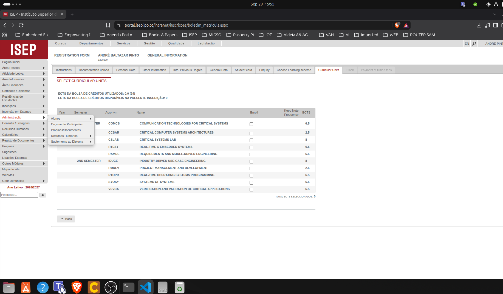

# Cadeiras inscritas:

> COMCS : Communication Technologies for critical systems : 6.5
> CCSAR : Critical Computer Systems Architectures : 2.5
> CSLAB : Critical Systems Lab : 8
> RTESY : Real-Time & Embedded Systems : 6.5 
> RAMDE : Requirements and model-drive engineering : 6.5
> IDUCE : Industry-driven use-case engineering : 8
> PMDEV : Project Management and Development : 2.5
> RTOPR : Real-time Operating Systems Programming : 6.5
> SYOSY : Systems of Systems : 6.5
> VEVCA : Verifivation and validation of critical applications : 6.5